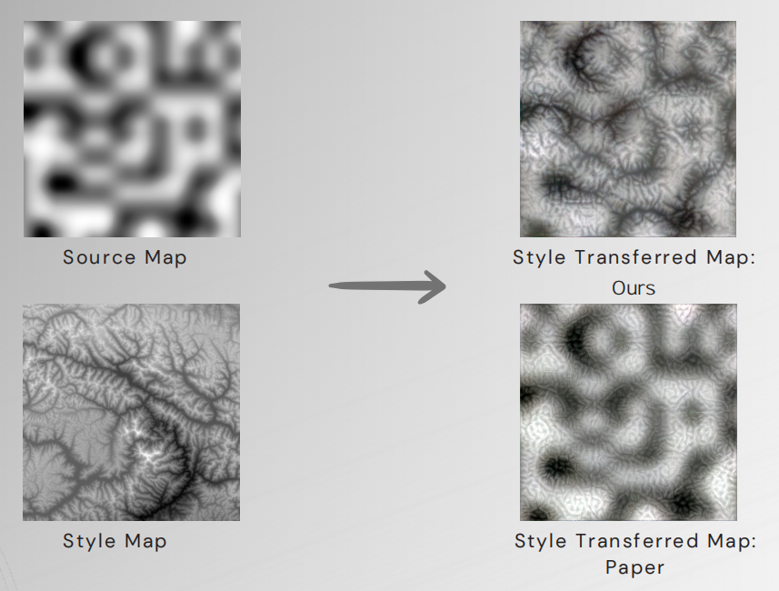

# Procedural-terrain-generation-with-style-transfer

PyTorch reimplementation and experimentation of the original work on terrain style transfer, focusing on different spatial loss formulations. The project reproduces the method and explores alternative spatial losses to study their effect on morphology transfer.

This project is unique in that it does not train a generator or the feature network. The feature extractor is frozen, and optimization is performed directly on the input image. The image is iteratively updated by minimizing a weighted combination of losses that preserve content while converging to the target style (e.g., Gram/spatial style losses) with optional total-variation regularization.

### Project Structure

This repository contains several .py files for both the computation of the procedural noise maps and the transferring of terrain morphology. The implementation is in PyTorch. My focus is now shifting to deep prior image generators for the creation of the output image, feel free to reach out for the latest implementations, which are currently achieving the best results. 

- `procedural_noise_functions.py`: 
    - **Description**: This file contains all the accessory functions needed to procedurally generate noise

- `generate_noise.py`: 
    - **Description**: A generate file that when called save in the noise foldes a collection of generated noise images in grayscale. Takes as input the dimension of the output image and a flag discriminating between pern and explicit noise 

- `transfer_morphology.py`: 
    - **Description**: Contains the core code for generating transferring of the morphological features. Takes as input the number of necessary iterations.

- `terrain_transfer_pytorch.py`: 
    - **Description**: PyTorch reimplementation of the model. 

### Generating procedural maps

### Style transferring morphological features

### Volumetric representation

### Comparative Results

- Achieved visually accurate terrain maps with **15.0x lower GPU memory usage** than GAN-based methods, surpassing the original work with a **+1.7% SSIM improvement**.

#### Visual Comparison

